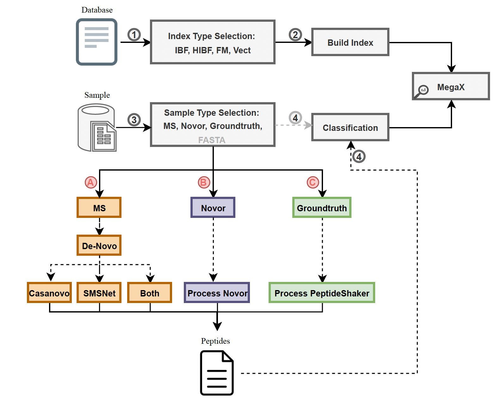

# MTS-DeNovoDI: **M**utation-**T**olerance **S**earching with **De** **Novo** Sequencing and **D**atabase **I**ndexing

## Table of contents

* [Description](#description)
* [Installation](#installation)
* [Input](#input)
* [Use-cases](#use-cases)
* [Output](#output)
* [Config](#config)


## <a name="description"></a>Description
MTS-DeNovoDI is a pipeline based on Snakemake, designed to utilize two de-novo sequencing algorithms [Casanovo](https://github.com/Noble-Lab/casanovo) and [SMSNet](https://github.com/cmb-chula/SMSNet/tree/master#readme) and classify the resultant peptides against a protein reference database. The primary classification relies on the [MegaX](https://github.com/lutfia95/MegaX/) tool. Additionally, the pipeline encompasses other functionalities, including the classification of ground truth peptides, [Novor](https://github.com/compomics/denovogui) peptides, and raw FASTA files of peptides. The de-novo algorithms are deep learning models, allowing users to download the corresponding pre-trained models for each algorithm: [Casanovo-Models](https://github.com/Noble-Lab/casanovo/releases); for SMSNet, the user can use the pre-trained model from [denovopipeline](https://github.com/denisbeslic/denovopipeline/). _Because of the diverse modifications in MS data, we strongly advise tuning the existing model using your specific target dataset and settings._

## <a name="installation"></a>Installation   
Snakemake should be manually installed from the [website](https://snakemake.readthedocs.io/en/stable/getting_started/installation.html), or by:
```
conda install -n env_name -c conda-forge mamba
conda activate env_name
mamba create -c conda-forge -c bioconda -n snakemake_env snakemake
```

The pipeline includes all necessary environments to install all required packages.
```
git clone https://github.com/lutfia95/MTS-DeNovoDI.git  
cd MTS-DeNovoDI
snakemake --core 20 --use-conda
```

## <a name="input"></a>Input
MTS-DeNovoDI requires three input files: database, matrix, and samples. The sample file is a tab-separated file containing the sample name and its corresponding path.

```
sample	file_path
sample_name_1	/path/to/sample_name_1.fasta
sample_name_2	/path/to/sample_name_2.fasta
sample_name_3	/path/to/sample_name_3.fasta
```


## <a name="use-cases"></a>Use-cases


<b> De-Novo Peptide Sequencing of MGF Files</b><br>
[Proteowizard](https://anaconda.org/bioconda/proteowizard) `msconvert` can be used to convert the `raw,` `mzxml,` and `mzml` files to `mgf` format. MTS-DeNovoDI can sequence the `mgf`files in three different scenarios (Casanovo, SMSNet, or both tools). Setting the `peptide_cutoff` value for each sequencing method is important, as it will filter out all peptides with lower scores. _Since casanovo v4.1.0, users can run peptide sequencing using CPU only!_

```
 sample_type: 'mgf'
 DE_NOVO_SEQ:
     algorithm: 'both' #['casanovo', 'smsnet', 'both']
     casanovo_model: "path/to/casanovo_massivekb.ckpt" 
     smsnet_model: ""path/to/MassIVE_HCD"
     casanovo_gpu: "CUDA_VISIBLE_DEVICES=1"
     smsnet_gpu: "CUDA_VISIBLE_DEVICES=1"
     casanovo_mode: "sequence"
     peptide_cutoff: 75 #75%
```

<b> Novor Peptides </b><br>
Deep learning sequencing methods are trained on specific modifications that cannot be altered during offline sequencing. For this reason, we have included the option to integrate the results file from Noro (real-time peptide sequencing) into the pipeline.
```
sample_type: 'novor'
```

<b> Pseudo Ground Truth Peptides </b><br>
Incorporating pseudo-ground truth results from database searches into the pipeline for classification is also feasible. We recommend utilizing [SearchGUI](https://github.com/compomics/searchgui) and PeptideShaker and exporting the "Extended PSM Report" for this purpose.

```
sample_type: 'peptide_shaker'
```

<b> Peptides in FASTA File </b><br>
By disabling the sequencing mode, users can provide the peptide input files in the standard FASTA format.
```
sample_type: 'fa'
```
```
> example_peptide_header
ANMLYNIA
```

## <a name="output"></a>Output
The results of the pipeline primarily consist of the visualization of MegaX counting results. The output will include three plots:

`results/reports/peptides_vis_{sample}.pdf`: total number of peptides, including short peptides (peptide_length < k_mer).    
`{sample}_classification_report.pdf`: normalized scores at the species/strain level.    
`results/reports/{sample}_assignment_report.pdf`: top scores in decreasing order at the protein level.   
`results/reports/reference_hist.pdf`: database length histogram. 

## <a name="config"></a>Config
```
 database: 'path/to/reference.fasta'
 samples: 'data/sample_list.tsv'
 matrix: "data/matrix/blosum62" #['blosum62', 'pam120']
 sample_type: 'fa' #['mgf', 'fa', 'novor', 'peptide_shaker']

 DE_NOVO_SEQ: #if mgf
     algorithm: 'both' #['casanovo', 'smsnet', 'both'] please note, both algorithms require GPU (atm).
     casanovo_model: "path/to/casanovo_massivekb.ckpt" 
     smsnet_model: ""path/to/MassIVE_HCD"
     casanovo_gpu: "" #this could be e.g. 'CUDA_VISIBLE_DEVICES=2,' or 'srun --gpus 1 --mem 50GB -c 32 '
     smsnet_gpu: "" #this could be e.g. 'CUDA_VISIBLE_DEVICES=2,' or for slurm 'srun --gpus 1 --mem 50GB -c 32 '
     casanovo_mode: "sequence"
     peptide_cutoff: 60 # cut-off value of peptide scores (used for Casanovo, Novor and SMSNet sequencing scores)

 MEGAX_MODE: 'classification' #['stat', 'mutate_stat', 'write_db', 'simulate_peptides', 'mutate_seq_len', 'classification']
 INDEX_TYPE: 'IBF' #['IBF', 'HIBF', 'HIBF_REF', 'BS', 'FM_IDX']

 GENERAL:
  threads: 40 #number of threads for mutations to be performed, also used for the binary search algorithm
  k_mer: 5 #k_mer size
  score: 25 #muation score, if the score is 100 megaX will not generate any mutations
  window_size: 5 #minimiser window size
  minimizer: 0 #use forward minimizer computation 
  simulation_errors: 1 #number of simulation errors used in the simulate_peptides mode 
  number_of_peptides: 1000 #number of simulated peptides
  number_of_muatetd_seq: 5 #number of generated sequences of every single sequence (used for mutating to seq length)
  
 HIBF:
   alpha: 1.2 #alpha value
   sketch_bits: 12 #HyperLogLog sketch bits
   maximum_false_positive_rate: 0.01 #maximum false positive rate for each filter
   threads: 10 #number of building threads
   hashes: 2 #number of hash functions
   split_size: 2 #size of each sketch splits (user bins in each filter)
   max_rearrangement: 0.5 #maximum rearrangement ratio
   disable_rearrangement: 1 #1: True ; 0: False
   disable_estimation: 1 #1: True ; 0: False
   threshold: 1 #threshold to assign the query to user bin, will be changed in the classification step

 IBF: 
   hashes: 2 #number of hash functions

 FM_INDEX:
   number_of_references: 3 #total number of references in the input reference file; this parameter is necessary for vectorization [grep -c ">" input.fasta]

 CLASSIFICATION:
   classification_threshold: 0.70 #assignments threshold of each peptide sequence (k-mer content)

 VISUALIZATION:
   depth: 60 #Number of samples shown in the related plot (used for histogram and classification output)
```
